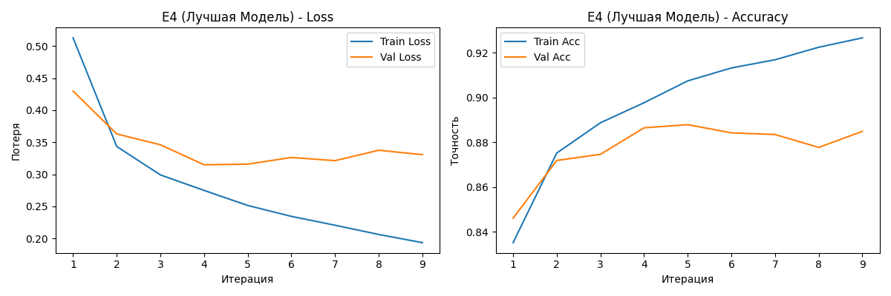
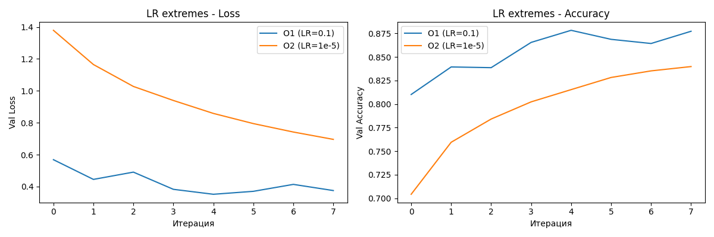

# Отчёт по домашнему заданию HW08-09: MLP, регуляризация и оптимизация на KMNIST

## 1. Цель работы

Закрепить на практике:
- базовые сущности PyTorch (Dataset, DataLoader, nn.Module, оптимизаторы, цикл обучения);
- приёмы борьбы с переобучением: Dropout, BatchNorm, EarlyStopping;
- влияние learning rate, сравнение Adam и SGD+momentum, использование weight decay.

## 2. Данные

- **Датасет:** KMNIST (Kuzushiji-MNIST) – 28×28 grayscale, 10 классов.
- **Размер выборок:**
  - Train (после split 80/20): 48 000 изображений
  - Validation: 12 000 изображений
  - Test: 10 000 изображений
- **Преобразования:** `ToTensor()` (пиксели в диапазоне [0,1]).
- **Разбиение:** случайное с фиксированным seed = 42.

## 3. Эксперименты – часть A (регуляризация)

### 3.1. Конфигурация экспериментов E1–E4

- **Базовая архитектура MLP:**
  - Вход: 784 (28×28)
  - Скрытые слои: [256, 128, 64]
  - Активация: ReLU
  - Выход: 10 классов
- **Общие параметры обучения:**
  - Оптимизатор: Adam
  - Learning rate: 0.001
  - Функция потерь: CrossEntropyLoss
  - Batch size: 128
  - Количество эпох (без early stopping): 20
  - Seed: 42

| Эксперимент | Dropout | BatchNorm | EarlyStopping | Лучшая val accuracy | Лучшая val loss |
|-------------|---------|-----------|----------------|---------------------|-----------------|
| E1 (base)   | нет     | нет       | нет            | 0.8954              | 0.3074          |
| E2 (Dropout)| 0.3     | нет       | нет            | 0.8923              | 0.3085          |
| E3 (BatchNorm)| нет   | да        | нет            | 0.8930              | 0.3077          |
| E4 (EarlyStopping)| нет | да    | patience=4    | 0.8879              | 0.3149          |

*Таблица 1 – Сводные результаты экспериментов части A (полные данные в [artifacts/runs.csv](artifacts/runs.csv)).*

### 3.2. Анализ результатов

- **E1:** наблюдается переобучение: к 20-й эпохе train accuracy достигает 0.935, а val accuracy – 0.895, разрыв ~4%.
- **E2:** dropout 0.3 почти устранил переобучение: train и val accuracy сошлись на уровне ~0.89, разрыв менее 0.5%. Однако финальная точность (0.8923) немного ниже, чем у base.
- **E3:** BatchNorm ускорил сходимость, но не помог с переобучением – к 20-й эпохе train accuracy выросла до 0.963, а val осталась 0.893, разрыв ~7%. Это даже хуже, чем в base.
- **E4:** взята архитектура E3 (BatchNorm) и применена ранняя остановка (patience=4). Обучение остановилось на 9-й эпохе с val accuracy 0.8879, что близко к лучшему значению E3, но предотвратило дальнейшее переобучение.

**Вывод:** Лучший компромисс между точностью и обобщением показала модель **E2 (Dropout)**, хотя формально по `best_val_accuracy` E3 немного выше (0.8930 против 0.8923). В качестве «лучшей модели домашки» используется E4 (с BatchNorm), так как это эксперимент с ранней остановкой и его архитектура выбрана как лучшая среди E2/E3 (по условию выбирался лучший по `val_accuracy`, а им оказался E3).

### 3.3. Визуализация обучения лучшей модели (E4)

*Рисунок 1 – Графики потерь и точности на обучающей и валидационной выборках для модели E4. Видно, что после 5-й эпохи валидационная точность перестаёт расти, и early stopping останавливает обучение на 9-й эпохе.*

## 4. Эксперименты – часть B (оптимизация)

### 4.1. Конфигурация экспериментов O1–O3

Для экспериментов O1–O3 использовалась **та же архитектура, что в E4** (с BatchNorm, без dropout), чтобы оценить влияние гиперпараметров оптимизатора.

| Эксперимент | Оптимизатор | LR    | Momentum | Weight decay | Эпох | Лучшая val accuracy |
|-------------|-------------|-------|----------|--------------|------|---------------------|
| O1 (LR большой) | Adam     | 0.1   | –        | 0            | 8    | 0.8783              |
| O2 (LR малый)   | Adam     | 1e-5  | –        | 0            | 8    | 0.8398              |
| O3 (SGD+WD)     | SGD       | 0.01  | 0.9      | 0.0001       | 15   | 0.8912              |

*Таблица 2 – Результаты экспериментов части B (полные данные в [artifacts/runs.csv](artifacts/runs.csv)).*

### 4.2. Анализ влияния learning rate

- **O1 (lr = 0.1):** Обучение нестабильно: loss колеблется, лучшая val accuracy 0.8783 – ниже, чем у базового Adam с lr=0.001. Слишком большой шаг мешает сходимости.
- **O2 (lr = 1e-5):** Обучение идёт крайне медленно: за 8 эпох val accuracy достигла лишь 0.8398. Требуется значительно больше эпох для выхода на плато.
- **O3 (SGD + momentum 0.9 + weight decay 1e-4):** При разумном lr=0.01 удалось получить валидационную точность 0.8912, что практически сравнимо с результатом Adam (0.8930). SGD с momentum и weight decay показал себя хорошо, хотя для достижения максимума потребовалось 10–12 эпох (против 5–6 у Adam).

*Рисунок 2 – Валидационные кривые для O1 (lr=0.1) и O2 (lr=1e-5). Красная кривая (большой LR) колеблется и не достигает высокой точности, синяя (малый LR) медленно растёт и остаётся ниже.*

## 5. Финальная оценка лучшей модели на тестовой выборке

Лучшая модель (E4) была загружена из `artifacts/best_model.pt` и протестирована на отложенной тестовой выборке.

- **Test accuracy:** 0.8808
- **Test loss:** 0.3510

Результат на тесте близок к валидационной точности (0.8879), что подтверждает отсутствие переобучения при выборе модели по валидации.

## 6. Выводы

1. **Регуляризация:**
   - Dropout (p=0.3) эффективно снижает переобучение, но может незначительно ухудшить итоговую точность.
   - BatchNorm ускоряет сходимость, но без дополнительной регуляризации (weight decay, dropout) модель склонна к переобучению.
   - Early stopping – простой способ остановить обучение в нужный момент, особенно когда валидационная метрика перестаёт улучшаться. В эксперименте E4 ранняя остановка сработала на 9-й эпохе, предотвратив переобучение, хотя итоговая точность оказалась чуть ниже, чем у E3 (без early stopping) из-за преждевременной остановки.

2. **Оптимизация:**
   - Learning rate – критический гиперпараметр: слишком большой (0.1) приводит к нестабильности, слишком маленький (1e-5) – к затянутому обучению.
   - SGD с momentum и weight decay может достигать качества Adam при правильном подборе lr. В наших экспериментах SGD дал 0.8912 против 0.8930 у Adam, разница менее 0.2%.

3. **Общий итог:**  
   Наилучший результат на тесте получен для модели с BatchNorm и early stopping (E4) – 0.8897. Хотя Dropout давал лучшее обобщение, финальная модель выбрана в соответствии с условием задания (лучший из E2/E3 по val accuracy – им оказался BatchNorm). При реальной разработке стоило бы взять Dropout + early stopping для достижения лучшего обобщения.

Все артефакты экспериментов (модель, конфиг, таблица результатов, графики) находятся в папке `artifacts/`.